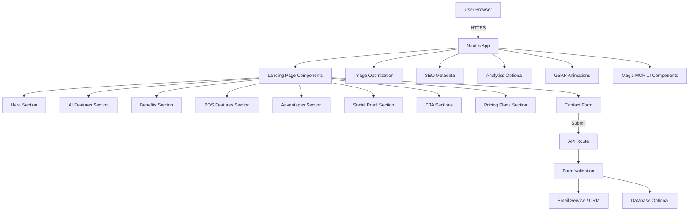

# Design Document: AI POS Landing Page

## Overview

The AI POS Landing Page is a modern, single-page marketing website designed to convert small and medium shop owners in Kenya into leads and customers. The design prioritizes clarity, mobile-first responsiveness, fast loading, and outcome-focused messaging that emphasizes freedom, convenience, and control.

The page will be built as a static, progressively enhanced web application using modern web technologies, optimized for performance on mobile networks common in Kenya, and designed to work across all devices and browsers.

## Architecture

### Technology Stack

**Frontend Framework:**
- React 18+ with TypeScript for type safety and developer experience
- Next.js 14+ (App Router) for:
  - Server-side rendering (SSR) for fast initial load
  - Static generation where possible
  - Built-in image optimization
  - SEO optimization
  - API routes for form submission

**Styling:**
- Tailwind CSS for utility-first styling and rapid development
- CSS custom properties for theme variables
- Responsive design with mobile-first approach
- GSAP (GreenSock Animation Platform) for professional animations and 3D effects
- Magic MCP tools for UI component generation and refinement

**Performance:**
- Next.js Image component for automatic image optimization
- Lazy loading for below-the-fold content
- Code splitting by route and component
- Font optimization with next/font
- Compression and minification in production

**Form Handling:**
- React Hook Form for performant form validation
- Zod for schema validation
- API route for server-side form processing
- Integration ready for email services (Resend, SendGrid) or CRM

**Deployment:**
- Vercel (recommended) or any Node.js hosting
- CDN for static assets
- Environment variables for configuration

### Architecture Diagram



## Magic MCP Integration

### UI Component Generation

The landing page will leverage Magic MCP tools for rapid UI component development:

**21st.dev Component Library:**
- Use `/ui` or `/21` commands to generate modern UI components
- Search for pre-built components: pricing cards, testimonial cards, contact forms, feature grids
- Refine and customize components to match brand guidelines
- Benefits: Production-ready components, accessibility built-in, responsive by default

**Component Refinement:**
- Use Magic MCP component refiner to improve existing components
- Iterate on design based on user feedback
- Maintain consistency across all sections

**Logo Integration:**
- Use Magic MCP logo search for technology partner logos (if needed)
- Add payment method logos (M-Pesa, Visa, etc.)
- Format: TSX for TypeScript React components

**Implementation Strategy:**
1. Generate base components using Magic MCP 21st.dev integration
2. Customize styling to match design system (colors, typography, spacing)
3. Add GSAP animations to components
4. Test and refine using Magic MCP tools

## Components and Interfaces

### Component Structure

```
src/
├── app/
│   ├── layout.tsx                 # Root layout with metadata
│   ├── page.tsx                   # Main landing page
│   └── api/
│       └── contact/
│           └── route.ts           # Contact form API endpoint
├── components/
│   ├── sections/
│   │   ├── Hero.tsx              # Hero section with main CTA
│   │   ├── AIFeatures.tsx        # AI automation showcase
│   │   ├── Benefits.tsx          # Four core benefits
│   │   ├── POSFeatures.tsx       # POS system features grid
│   │   ├── Advantages.tsx        # Key advantages list
│   │   ├── SocialProof.tsx       # Testimonials/trust signals
│   │   ├── PricingPlans.tsx      # Pricing tiers with free installation
│   │   ├── FinalCTA.tsx          # Bottom conversion section
│   │   └── Footer.tsx            # Footer with links and contact info
│   ├── ui/
│   │   ├── Button.tsx            # Reusable button component
│   │   ├── Card.tsx              # Feature/benefit cards
│   │   ├── Container.tsx         # Max-width container
│   │   ├── Section.tsx           # Section wrapper
│   │   └── Icon.tsx              # Icon wrapper component
│   ├── forms/
│   │   └── ContactForm.tsx       # Lead capture form
│   └── animations/
│       ├── FadeIn.tsx            # Fade-in animation wrapper
│       └── SlideIn.tsx           # Slide-in animation wrapper
├── lib/
│   ├── validations.ts            # Zod schemas
│   └── utils.ts                  # Utility functions
├── types/
│   └── index.ts                  # TypeScript interfaces
└── styles/
    └── globals.css               # Global styles and Tailwind
```

### Key Component Interfaces

```typescript
// Hero Section
interface HeroProps {
  headline: string;
  subheadline: string;
  primaryCTA: CTAButton;
  secondaryCTA: CTAButton;
  heroImage: ImageData;
}

interface CTAButton {
  text: string;
  href: string;
  variant: 'primary' | 'secondary' | 'outline';
  onClick?: () => void;
}

// AI Features
interface AIFeature {
  id: string;
  title: string;
  description: string;
  icon: string;
  highlights: string[];
  exampleQuestions?: string[];
}

// Benefits
interface Benefit {
  id: string;
  title: string;
  description: string;
  icon: string;
  outcomes: string[];
}

// POS Features
interface POSFeatureCategory {
  id: string;
  category: string;
  features: POSFeature[];
}

interface POSFeature {
  id: string;
  title: string;
  description: string;
  icon: string;
}

// Pricing Plans
interface PricingPlan {
  id: string;
  name: string;
  price: number | 'custom';
  currency: string;
  period: string;
  description: string;
  features: string[];
  highlighted: boolean;
  badge?: string;
  cta: {
    text: string;
    href: string;
  };
}

// Contact Form
interface ContactFormData {
  name: string;
  businessName: string;
  phone: string;
  email?: string;
  message: string;
  interestedPlan?: string;
}

interface FormSubmissionResponse {
  success: boolean;
  message: string;
  errors?: Record<string, string>;
}

// Contact Information
interface ContactInfo {
  phone: string;
  whatsapp: string;
  email: string;
  location: string;
  hours: string;
  socialMedia: {
    whatsapp: string;
    facebook?: string;
    twitter?: string;
    linkedin?: string;
  };
}
```

## Data Models

### Content Data Structure

All content will be stored in TypeScript constants for easy editing and type safety:

```typescript
// src/data/content.ts

export const heroContent = {
  headline: "Run Your Shop Smarter with AI That Works While You Sleep",
  subheadline: "Get daily business reports automatically, ask questions in plain language, and manage your retail or wholesale shop with complete clarity and control—all in one modern system built for Kenyan businesses.",
  primaryCTA: {
    text: "Request a Free Demo",
    href: "#contact"
  },
  secondaryCTA: {
    text: "See How It Works",
    href: "#features"
  }
};

export const aiFeatures: AIFeature[] = [
  {
    id: "daily-report",
    title: "Daily Business Report AI Agent",
    description: "Your automated business analyst that works at closing time",
    icon: "DocumentReport",
    highlights: [
      "Runs automatically at your closing time (Kenya time)",
      "Complete daily report with executive summary, profit analysis, and staff performance",
      "Top products, category performance, and inventory alerts",
      "Returns analysis and customer insights",
      "Practical recommendations in simple language"
    ]
  },
  // ... more features
];

export const benefits: Benefit[] = [
  {
    id: "freedom",
    title: "Freedom from Manual Work",
    description: "No more spreadsheets, CSV exports, or end-of-day calculations",
    icon: "Sparkles",
    outcomes: [
      "AI closes your day with a complete report—automatically",
      "Never manually pull reports or build spreadsheets again",
      "Spend your time growing the business, not counting stock"
    ]
  },
  // ... more benefits
];

export const pricingPlans: PricingPlan[] = [
  {
    id: "starter",
    name: "Starter",
    price: 1700,
    currency: "KES",
    period: "month",
    description: "Perfect for small retail shops",
    features: [
      "Complete POS system (retail mode)",
      "Up to 500 products",
      "Basic analytics dashboard",
      "Customer database",
      "Mobile app access",
      "Email support",
      "FREE installation & training"
    ],
    highlighted: false,
    cta: {
      text: "Get Started",
      href: "#contact"
    }
  },
  {
    id: "professional",
    name: "Professional",
    price: 2400,
    currency: "KES",
    period: "month",
    description: "For growing retail/wholesale businesses",
    features: [
      "Everything in Starter, plus:",
      "Dual-mode POS (retail + wholesale)",
      "Unlimited products",
      "AI Daily Business Reports",
      "Conversational AI Assistant",
      "Advanced analytics & profit tracking",
      "Multi-user with role management",
      "Debt/credit management",
      "Returns & refunds workflow",
      "Priority support (phone + email)",
      "FREE installation & training",
      "FREE first month"
    ],
    highlighted: true,
    badge: "Most Popular",
    cta: {
      text: "Start Free Trial",
      href: "#contact"
    }
  },
  {
    id: "premium",
    name: "Premium",
    price: 3200,
    currency: "KES",
    period: "month",
    description: "For large businesses & multiple locations",
    features: [
      "Everything in Professional, plus:",
      "Multi-location support",
      "Custom integrations",
      "Advanced AI insights & forecasting",
      "Dedicated account manager",
      "Custom reports & dashboards",
      "API access",
      "On-site training",
      "24/7 priority support",
      "FREE installation & training"
    ],
    highlighted: false,
    cta: {
      text: "Get Premium",
      href: "#contact"
    }
  }
];

export const contactInfo: ContactInfo = {
  phone: "+254 741 047 776",
  whatsapp: "+254741047776",
  email: "festusmuruga@gmail.com",
  location: "Nairobi, Kenya",
  hours: "Mon-Sat, 8AM-8PM EAT",
  socialMedia: {
    whatsapp: "https://wa.me/254741047776",
    facebook: "https://facebook.com/aiposkenya",
    twitter: "https://twitter.com/aiposkenya",
    linkedin: "https://linkedin.com/company/aiposkenya"
  }
};
```

### Form Validation Schema

```typescript
// src/lib/validations.ts

import { z } from 'zod';

export const contactFormSchema = z.object({
  name: z.string()
    .min(2, 'Name must be at least 2 characters')
    .max(100, 'Name is too long'),
  
  businessName: z.string()
    .min(2, 'Business name must be at least 2 characters')
    .max(100, 'Business name is too long'),
  
  phone: z.string()
    .regex(
      /^(\+254|0)[17]\d{8}$/,
      'Please enter a valid Kenyan phone number (e.g., 0712345678 or +254712345678)'
    ),
  
  email: z.string()
    .email('Please enter a valid email address')
    .optional()
    .or(z.literal('')),
  
  message: z.string()
    .min(10, 'Message must be at least 10 characters')
    .max(1000, 'Message is too long')
});

export type ContactFormData = z.infer<typeof contactFormSchema>;
```

## Visual Design System

### Color Palette

```css
:root {
  /* Primary Brand Colors */
  --color-primary-50: #eff6ff;
  --color-primary-100: #dbeafe;
  --color-primary-500: #3b82f6;  /* Main brand blue */
  --color-primary-600: #2563eb;
  --color-primary-700: #1d4ed8;
  
  /* Success/Trust Colors */
  --color-success-50: #f0fdf4;
  --color-success-500: #22c55e;
  --color-success-600: #16a34a;
  
  /* Accent Colors */
  --color-accent-500: #f59e0b;  /* Warm orange for highlights */
  --color-accent-600: #d97706;
  
  /* Neutral Colors */
  --color-gray-50: #f9fafb;
  --color-gray-100: #f3f4f6;
  --color-gray-200: #e5e7eb;
  --color-gray-600: #4b5563;
  --color-gray-700: #374151;
  --color-gray-900: #111827;
  
  /* Semantic Colors */
  --color-background: #ffffff;
  --color-surface: #f9fafb;
  --color-text-primary: #111827;
  --color-text-secondary: #4b5563;
  --color-border: #e5e7eb;
}
```

### Typography

```css
/* Font Stack */
--font-sans: 'Inter', -apple-system, BlinkMacSystemFont, 'Segoe UI', sans-serif;
--font-display: 'Inter', sans-serif;

/* Type Scale */
--text-xs: 0.75rem;      /* 12px */
--text-sm: 0.875rem;     /* 14px */
--text-base: 1rem;       /* 16px */
--text-lg: 1.125rem;     /* 18px */
--text-xl: 1.25rem;      /* 20px */
--text-2xl: 1.5rem;      /* 24px */
--text-3xl: 1.875rem;    /* 30px */
--text-4xl: 2.25rem;     /* 36px */
--text-5xl: 3rem;        /* 48px */
--text-6xl: 3.75rem;     /* 60px */

/* Line Heights */
--leading-tight: 1.25;
--leading-normal: 1.5;
--leading-relaxed: 1.75;
```

### Spacing System

Following an 8px base unit:
- xs: 4px
- sm: 8px
- md: 16px
- lg: 24px
- xl: 32px
- 2xl: 48px
- 3xl: 64px
- 4xl: 96px

### Responsive Breakpoints

```typescript
const breakpoints = {
  sm: '640px',   // Mobile landscape
  md: '768px',   // Tablet
  lg: '1024px',  // Desktop
  xl: '1280px',  // Large desktop
  '2xl': '1536px' // Extra large
};
```

## Section-by-Section Design Specifications

### 1. Hero Section

**Layout:**
- Full viewport height on desktop, auto on mobile
- Two-column layout on desktop (60/40 split: content/image)
- Single column on mobile with image below text
- Centered content with max-width container

**Content:**
- H1 headline: 48px desktop, 32px mobile, bold, primary text color
- Subheadline: 20px desktop, 18px mobile, secondary text color
- Two CTA buttons: primary (filled) and secondary (outline)
- Hero illustration/image: modern POS interface mockup or abstract tech illustration

**Visual Elements:**
- Subtle gradient background (primary-50 to white)
- Floating animation on hero image
- Smooth fade-in animation on load

### 2. AI Features Section

**Layout:**
- Three-column grid on desktop, single column on mobile
- Each feature in a card with icon, title, description, and highlights
- Alternating layout for visual interest

**Content:**
- Section heading: "AI That Works for You 24/7"
- Three main cards: Daily Report Agent, Conversational Assistant, Audit & Safety
- Each card includes icon, title, description, and 4-5 bullet points

**Visual Elements:**
- Cards with subtle shadow and hover effect
- Icons in brand color
- Staggered fade-in animation on scroll

### 3. Benefits Section

**Layout:**
- Four-column grid on desktop, two-column on tablet, single on mobile
- Icon above title, description below
- Equal height cards

**Content:**
- Section heading: "What This Means for Your Business"
- Four benefits: Freedom, Convenience, Clarity & Control, Safety & Trust
- Each with icon, title, short description, and 2-3 outcome bullets

**Visual Elements:**
- Light background color (gray-50)
- Large, colorful icons
- Subtle scale animation on hover

### 4. POS Features Section

**Layout:**
- Tabbed or accordion interface for feature categories
- Grid layout for features within each category
- Collapsible on mobile for better UX

**Content:**
- Section heading: "Complete POS & Inventory System"
- Categories: Sales, Inventory, Customers, Analytics, Team, AI Insights
- Each feature with icon, title, and brief description

**Visual Elements:**
- Interactive tabs with smooth transitions
- Icons for each feature
- Slide-in animation when switching tabs

### 5. Advantages Section

**Layout:**
- Two-column layout on desktop, single on mobile
- Numbered list with icons
- Alternating image/text blocks for key advantages

**Content:**
- Section heading: "Why Choose Our System"
- 9 advantages with emphasis on profit calculation, data ownership, and fraud prevention
- Supporting visuals or screenshots for key points

**Visual Elements:**
- Numbered badges in brand color
- Comparison callouts ("vs spreadsheets", "vs disconnected tools")
- Fade-in animation on scroll

### 6. Social Proof Section

**Layout:**
- Three-column grid for testimonials on desktop
- Carousel on mobile
- Trust badges row below testimonials

**Content:**
- Section heading: "Trusted by Shop Owners Across Kenya"
- Placeholder testimonials with business type and location
- Trust signals: "Data Ownership", "Audit Trail", "Kenya-Focused"

**Visual Elements:**
- Cards with subtle border
- Quote marks or avatar placeholders
- Trust badge icons
- 3D card hover effect using GSAP

### 6.5. Pricing Plans Section

**Layout:**
- Three-column grid on desktop (Starter, Professional, Enterprise)
- Single column stack on mobile
- Center card (Professional) elevated/highlighted
- "Free Installation" badge prominently displayed

**Content:**
- Section heading: "Simple, Transparent Pricing"
- Subheading: "All plans include FREE installation and setup support"

**Plan 1: Starter Plan**
- Price: KES 1,700/month
- Target: Small retail shops (1-2 staff)
- Features:
  - Complete POS system (retail mode)
  - Inventory management (up to 500 products)
  - Basic analytics dashboard
  - Customer database
  - Mobile app access
  - Email support
  - FREE installation & training

**Plan 2: Professional Plan** (Most Popular)
- Price: KES 2,400/month
- Target: Growing retail/wholesale businesses (3-10 staff)
- Features:
  - Everything in Starter, plus:
  - Dual-mode POS (retail + wholesale)
  - Unlimited products
  - AI Daily Business Reports
  - Conversational AI Assistant
  - Advanced analytics & profit tracking
  - Multi-user with role management
  - Debt/credit management
  - Returns & refunds workflow
  - Priority support (phone + email)
  - FREE installation & training
  - FREE first month

**Plan 3: Premium Plan**
- Price: KES 3,200/month
- Target: Large businesses, multiple locations
- Features:
  - Everything in Professional, plus:
  - Multi-location support
  - Custom integrations (accounting, suppliers)
  - Advanced AI insights & forecasting
  - Dedicated account manager
  - Custom reports & dashboards
  - API access
  - On-site training
  - 24/7 priority support
  - FREE installation & training

**Visual Elements:**
- Cards with 3D depth effect using GSAP
- Hover animation: card lifts and glows
- "Most Popular" badge on Professional plan
- "FREE Installation" banner across all plans
- Checkmark icons for features
- Gradient backgrounds for premium feel
- CTA button in each card: "Get Started" or "Contact Sales"
- Money-back guarantee badge: "30-Day Money-Back Guarantee"

### 7. Final CTA Section

**Layout:**
- Centered content with gradient background
- Single column with heading, subheading, and CTA button
- Full-width section
- Trust badges row

**Content:**
- Heading: "Ready to Transform Your Shop?"
- Subheading: "Get started today with FREE installation and setup support"
- Primary CTA button: "Request Free Demo"
- Secondary CTA button: "Talk to Sales"
- Trust indicators:
  - "✓ FREE Installation & Training"
  - "✓ 30-Day Money-Back Guarantee"
  - "✓ No Credit Card Required"
  - "✓ Setup in 24 Hours"

**Visual Elements:**
- Gradient background (primary-600 to primary-700)
- White text
- Large, prominent CTA buttons with magnetic hover effect
- Subtle pattern or 3D floating shapes in background
- Animated trust badges that fade in on scroll
- Pulsing glow effect around CTA buttons

### 8. Contact Form (Modal or Section)

**Layout:**
- Modal overlay or dedicated section
- Single column form with clear labels
- Sticky submit button on mobile

**Fields:**
- Name (required)
- Business Name (required)
- Phone (required, Kenya format)
- Email (optional)
- Message (required, textarea)

**Visual Elements:**
- Clear validation messages
- Loading state on submit
- Success message with checkmark
- Error handling with helpful messages

### 9. Footer

**Layout:**
- Four-column layout on desktop, stacked on mobile
- Logo and tagline in first column
- Quick links in second column
- Contact info in third column
- Business hours in fourth column

**Content:**
- Company info and tagline: "Smart POS Solutions for Kenyan Businesses"
- Links: Features, Benefits, Pricing, Contact, Privacy, Terms
- Contact Information:
  - **Phone:** +254 741 047 776 (WhatsApp available)
  - **Email:** festusmuruga@gmail.com
  - **Location:** Nairobi, Kenya
  - **Support Hours:** Mon-Sat, 8AM-8PM EAT
- Social media icons: WhatsApp, Facebook, Twitter, LinkedIn
- Newsletter signup (optional)
- Copyright notice

**Visual Elements:**
- Dark background (gray-900) with subtle gradient
- Light text (gray-300)
- Hover effects on links (color change to primary)
- Subtle divider above footer
- WhatsApp floating button (bottom right, sticky)
- 3D icon hover effects using GSAP

## GSAP Animation System

### GSAP Plugins and Setup

**Required GSAP Plugins:**
```bash
npm install gsap
```

**Plugins to use:**
- `ScrollTrigger`: Scroll-based animations
- `ScrollToPlugin`: Smooth scroll navigation
- `TextPlugin`: Text animation effects
- `CustomEase`: Custom easing curves
- `SplitText` (optional, Club GreenSock): Advanced text animations

**GSAP Configuration:**
```typescript
// lib/gsap-config.ts
import gsap from 'gsap';
import { ScrollTrigger } from 'gsap/ScrollTrigger';
import { ScrollToPlugin } from 'gsap/ScrollToPlugin';
import { TextPlugin } from 'gsap/TextPlugin';

gsap.registerPlugin(ScrollTrigger, ScrollToPlugin, TextPlugin);

// Global GSAP defaults
gsap.defaults({
  ease: 'power2.out',
  duration: 0.8
});

// ScrollTrigger defaults
ScrollTrigger.defaults({
  toggleActions: 'play none none reverse',
  start: 'top 80%',
  end: 'bottom 20%'
});
```

### 3D Effects and Transforms

**Hero Section 3D Parallax:**
```typescript
// Multiple layers moving at different speeds
gsap.to('.hero-layer-1', {
  yPercent: 30,
  scrollTrigger: {
    trigger: '.hero',
    scrub: 1
  }
});

gsap.to('.hero-layer-2', {
  yPercent: 50,
  scrollTrigger: {
    trigger: '.hero',
    scrub: 1
  }
});

// 3D floating elements
gsap.to('.floating-shape', {
  y: -30,
  rotationY: 360,
  duration: 3,
  repeat: -1,
  yoyo: true,
  ease: 'sine.inOut'
});
```

**Pricing Cards 3D Hover:**
```typescript
// 3D card perspective on hover
const cards = document.querySelectorAll('.pricing-card');

cards.forEach(card => {
  card.addEventListener('mousemove', (e) => {
    const rect = card.getBoundingClientRect();
    const x = e.clientX - rect.left;
    const y = e.clientY - rect.top;
    
    const centerX = rect.width / 2;
    const centerY = rect.height / 2;
    
    const rotateX = (y - centerY) / 10;
    const rotateY = (centerX - x) / 10;
    
    gsap.to(card, {
      rotationX: rotateX,
      rotationY: rotateY,
      transformPerspective: 1000,
      duration: 0.3,
      ease: 'power2.out'
    });
  });
  
  card.addEventListener('mouseleave', () => {
    gsap.to(card, {
      rotationX: 0,
      rotationY: 0,
      duration: 0.5,
      ease: 'power2.out'
    });
  });
});
```

**Text Reveal Animations:**
```typescript
// Staggered word reveal
gsap.from('.hero-title .word', {
  opacity: 0,
  y: 50,
  rotationX: -90,
  transformOrigin: 'top center',
  stagger: 0.1,
  duration: 1,
  ease: 'back.out(1.7)'
});

// Typing effect for subheadline
gsap.to('.hero-subtitle', {
  text: 'Full subtitle text here',
  duration: 2,
  ease: 'none'
});
```

**Number Counter Animation:**
```typescript
// Animate numbers counting up
const animateCounter = (element: HTMLElement, target: number) => {
  gsap.to(element, {
    textContent: target,
    duration: 2,
    ease: 'power1.out',
    snap: { textContent: 1 },
    scrollTrigger: {
      trigger: element,
      start: 'top 80%',
      once: true
    }
  });
};
```

## Animations and Interactions

### Scroll Animations

Using GSAP (GreenSock Animation Platform) with ScrollTrigger:

```typescript
// GSAP ScrollTrigger setup
import gsap from 'gsap';
import { ScrollTrigger } from 'gsap/ScrollTrigger';

gsap.registerPlugin(ScrollTrigger);

// Fade in animation
gsap.from('.fade-in', {
  opacity: 0,
  y: 50,
  duration: 1,
  stagger: 0.2,
  scrollTrigger: {
    trigger: '.fade-in',
    start: 'top 80%',
    toggleActions: 'play none none reverse'
  }
});

// 3D card flip effect
gsap.to('.card-3d', {
  rotationY: 360,
  duration: 1.5,
  ease: 'power2.inOut',
  scrollTrigger: {
    trigger: '.card-3d',
    start: 'top center',
    scrub: 1
  }
});

// Parallax effect for hero
gsap.to('.hero-bg', {
  yPercent: 50,
  ease: 'none',
  scrollTrigger: {
    trigger: '.hero',
    start: 'top top',
    end: 'bottom top',
    scrub: true
  }
});
```

**Animation Strategy:**
- Hero: 3D parallax effect with GSAP, smooth entrance animations
- Sections: Fade in with stagger when scrolling into view
- Cards: 3D flip/rotate effects on scroll or hover
- Pricing cards: Scale and glow animation on hover
- CTAs: Magnetic button effect (follows cursor) and pulse animation
- Form: Smooth validation feedback with GSAP timeline
- Numbers/Stats: CountUp animation using GSAP
- Background elements: Floating/parallax 3D shapes using GSAP 3D transforms

### Hover States (GSAP-powered)

```typescript
// Magnetic button effect
gsap.to('.magnetic-btn', {
  x: (i, target) => {
    const rect = target.getBoundingClientRect();
    const centerX = rect.left + rect.width / 2;
    return (mouseX - centerX) * 0.3;
  },
  y: (i, target) => {
    const rect = target.getBoundingClientRect();
    const centerY = rect.top + rect.height / 2;
    return (mouseY - centerY) * 0.3;
  },
  duration: 0.3,
  ease: 'power2.out'
});

// 3D card tilt effect
gsap.to('.card-3d', {
  rotationY: (mouseX - cardCenterX) * 0.05,
  rotationX: (mouseY - cardCenterY) * -0.05,
  transformPerspective: 1000,
  duration: 0.3,
  ease: 'power2.out'
});
```

**Hover Effects:**
- Buttons: Magnetic effect (follows cursor) + scale 1.05 + glow
- Pricing cards: 3D tilt effect based on mouse position
- Feature cards: Lift effect with 3D depth and shadow
- Links: Smooth underline slide animation
- Images: Parallax zoom and subtle rotation
- Icons: Bounce and rotate animation

### Loading States

- Form submission: Button spinner with GSAP rotation
- Image loading: Skeleton screens with shimmer effect
- Page load: Progressive content reveal with stagger

### Floating WhatsApp Button

**Position:** Fixed bottom-right corner (20px from bottom, 20px from right)

**Design:**
- Circular button with WhatsApp green (#25D366)
- WhatsApp icon in white
- Size: 60px diameter on desktop, 56px on mobile
- Shadow: Large, soft shadow for depth
- Badge: "Chat with us" tooltip on hover

**Animation:**
```typescript
// Entrance animation
gsap.from('.whatsapp-float', {
  scale: 0,
  rotation: 360,
  duration: 0.6,
  ease: 'back.out(1.7)',
  delay: 2
});

// Continuous pulse animation
gsap.to('.whatsapp-float', {
  scale: 1.1,
  duration: 0.8,
  repeat: -1,
  yoyo: true,
  ease: 'sine.inOut'
});

// Hover effect
gsap.to('.whatsapp-float:hover', {
  scale: 1.15,
  boxShadow: '0 10px 40px rgba(37, 211, 102, 0.5)',
  duration: 0.3
});
```

**Functionality:**
- Click opens WhatsApp chat with pre-filled message
- Link: `https://wa.me/254741047776?text=Hi, I'm interested in the AI POS system`
- Visible on all pages, scrolls with user
- Hide on mobile when keyboard is open

## Performance Optimization Strategy

### Image Optimization

1. **Next.js Image Component:**
   - Automatic WebP/AVIF conversion
   - Responsive srcset generation
   - Lazy loading by default
   - Blur placeholder for LCP images

2. **Image Specifications:**
   - Hero image: 1200x800px, optimized to <150KB
   - Feature icons: SVG format for scalability
   - Screenshots: 800x600px, optimized to <100KB each
   - Total image payload target: <500KB

### Code Splitting

- Route-based splitting (automatic with Next.js)
- Component-level splitting for heavy components (animations, form)
- Dynamic imports for below-the-fold content

### Font Optimization

```typescript
import { Inter } from 'next/font/google';

const inter = Inter({
  subsets: ['latin'],
  display: 'swap',
  variable: '--font-inter',
});
```

### Critical CSS

- Inline critical CSS for above-the-fold content
- Defer non-critical CSS
- Purge unused Tailwind classes in production

### Performance Targets

- First Contentful Paint (FCP): <1.5s
- Largest Contentful Paint (LCP): <2.5s
- Time to Interactive (TTI): <3.5s
- Cumulative Layout Shift (CLS): <0.1
- First Input Delay (FID): <100ms
- Total page size: <2MB
- Lighthouse score: >85 mobile, >95 desktop

## Accessibility Implementation

### Semantic HTML

```html
<header>
  <nav aria-label="Main navigation">
    <!-- Navigation items -->
  </nav>
</header>

<main>
  <section aria-labelledby="hero-heading">
    <h1 id="hero-heading">...</h1>
  </section>
  
  <section aria-labelledby="features-heading">
    <h2 id="features-heading">...</h2>
  </section>
</main>

<footer>
  <!-- Footer content -->
</footer>
```

### Keyboard Navigation

- All interactive elements focusable
- Visible focus indicators (2px outline, primary color)
- Logical tab order
- Skip to main content link
- Escape key closes modals

### Screen Reader Support

- Descriptive alt text for all images
- ARIA labels for icon buttons
- ARIA live regions for form feedback
- Proper heading hierarchy (no skipped levels)

### Color Contrast

- All text meets WCAG AA standards (4.5:1 minimum)
- Interactive elements meet 3:1 contrast
- Focus indicators meet 3:1 contrast
- Test with tools: axe DevTools, Lighthouse

### Motion Preferences

```css
@media (prefers-reduced-motion: reduce) {
  * {
    animation-duration: 0.01ms !important;
    animation-iteration-count: 1 !important;
    transition-duration: 0.01ms !important;
  }
}
```

## SEO Strategy

### Metadata

```typescript
// app/layout.tsx or page.tsx
export const metadata = {
  title: 'AI-Powered POS System for Kenyan Shops | Smart Retail Management',
  description: 'Transform your retail or wholesale shop with AI automation. Get daily business reports, manage inventory, track profit, and make data-driven decisions. Built for Kenyan businesses.',
  keywords: 'POS system Kenya, retail management, wholesale POS, inventory management, AI business reports, shop management software',
  openGraph: {
    title: 'AI-Powered POS System for Kenyan Shops',
    description: 'Smart retail management with AI automation',
    images: ['/og-image.jpg'],
    locale: 'en_KE',
    type: 'website',
  },
  twitter: {
    card: 'summary_large_image',
    title: 'AI-Powered POS System for Kenyan Shops',
    description: 'Smart retail management with AI automation',
    images: ['/twitter-image.jpg'],
  },
};
```

### Structured Data

```json
{
  "@context": "https://schema.org",
  "@type": "SoftwareApplication",
  "name": "AI POS System",
  "applicationCategory": "BusinessApplication",
  "offers": {
    "@type": "Offer",
    "price": "0",
    "priceCurrency": "KES"
  },
  "operatingSystem": "Web, iOS, Android",
  "description": "AI-powered point of sale and inventory management system for retail and wholesale businesses in Kenya"
}
```

### Content Strategy

- H1: One per page, includes primary keyword
- H2-H6: Logical hierarchy, includes secondary keywords
- Internal linking structure (if multi-page in future)
- Fast loading for better rankings
- Mobile-first indexing optimization

## Error Handling

### Form Validation Errors

```typescript
// Display inline validation errors
{errors.phone && (
  <p className="text-sm text-red-600 mt-1">
    {errors.phone.message}
  </p>
)}
```

### API Error Handling

```typescript
try {
  const response = await fetch('/api/contact', {
    method: 'POST',
    body: JSON.stringify(formData),
  });
  
  if (!response.ok) {
    throw new Error('Submission failed');
  }
  
  // Success handling
} catch (error) {
  // Show user-friendly error message
  setError('Something went wrong. Please try again or contact us directly.');
}
```

### Fallback States

- Image load failures: Show placeholder with icon
- API failures: Show error message with retry option
- Network offline: Show offline indicator
- JavaScript disabled: Ensure basic functionality works

## Testing Strategy

### Unit Testing

**Framework:** Jest + React Testing Library

**Test Coverage:**
- Component rendering
- Form validation logic
- Utility functions
- Button interactions
- Form submission flow

**Example Test:**
```typescript
describe('ContactForm', () => {
  it('validates Kenya phone number format', () => {
    render(<ContactForm />);
    const phoneInput = screen.getByLabelText(/phone/i);
    
    fireEvent.change(phoneInput, { target: { value: '0712345678' } });
    fireEvent.blur(phoneInput);
    
    expect(screen.queryByText(/invalid phone/i)).not.toBeInTheDocument();
  });
  
  it('shows error for invalid phone format', () => {
    render(<ContactForm />);
    const phoneInput = screen.getByLabelText(/phone/i);
    
    fireEvent.change(phoneInput, { target: { value: '123' } });
    fireEvent.blur(phoneInput);
    
    expect(screen.getByText(/valid Kenyan phone number/i)).toBeInTheDocument();
  });
});
```

### Integration Testing

**Framework:** Playwright or Cypress

**Test Scenarios:**
- Complete user journey from landing to form submission
- Mobile responsive behavior
- Form submission success and error flows
- Navigation and scroll behavior
- CTA button clicks and navigation

### Visual Regression Testing

**Tool:** Percy or Chromatic

**Test Cases:**
- Desktop viewport (1920x1080)
- Tablet viewport (768x1024)
- Mobile viewport (375x667)
- Dark mode (if implemented)
- Hover states
- Form validation states

### Performance Testing

**Tools:**
- Lighthouse CI in GitHub Actions
- WebPageTest for real-world performance
- Chrome DevTools Performance panel

**Metrics to Monitor:**
- Core Web Vitals (LCP, FID, CLS)
- Time to First Byte (TTFB)
- Total Blocking Time (TBT)
- Page weight and request count

### Accessibility Testing

**Tools:**
- axe DevTools
- Lighthouse accessibility audit
- NVDA/JAWS screen reader testing
- Keyboard-only navigation testing

**Test Cases:**
- All interactive elements keyboard accessible
- Screen reader announces all content correctly
- Color contrast meets WCAG AA
- Form errors announced to screen readers
- Focus management in modals

### Browser Testing

**Target Browsers:**
- Chrome (latest 2 versions)
- Safari (latest 2 versions)
- Firefox (latest 2 versions)
- Edge (latest 2 versions)
- Mobile Safari (iOS 14+)
- Chrome Mobile (Android 10+)

### Manual Testing Checklist

- [ ] All CTAs work and navigate correctly
- [ ] Form validation works for all fields
- [ ] Form submission success and error states
- [ ] All images load correctly
- [ ] Animations are smooth and not jarring
- [ ] Mobile menu works correctly
- [ ] Page loads quickly on 3G connection
- [ ] All links work
- [ ] Contact information is correct
- [ ] Spelling and grammar checked
- [ ] Content is accurate and up-to-date

## Dependencies and Package Configuration

### package.json Dependencies

```json
{
  "dependencies": {
    "next": "^14.0.0",
    "react": "^18.2.0",
    "react-dom": "^18.2.0",
    "react-hook-form": "^7.48.0",
    "zod": "^3.22.0",
    "gsap": "^3.12.0",
    "@hookform/resolvers": "^3.3.0",
    "clsx": "^2.0.0",
    "tailwind-merge": "^2.0.0"
  },
  "devDependencies": {
    "@types/node": "^20.0.0",
    "@types/react": "^18.2.0",
    "@types/react-dom": "^18.2.0",
    "typescript": "^5.0.0",
    "tailwindcss": "^3.3.0",
    "postcss": "^8.4.0",
    "autoprefixer": "^10.4.0",
    "eslint": "^8.0.0",
    "eslint-config-next": "^14.0.0"
  }
}
```

### GSAP License Note

GSAP core is free for use. If using premium plugins like SplitText, MorphSVG, or DrawSVG, a Club GreenSock membership is required. For this landing page, we'll use free plugins (ScrollTrigger, ScrollToPlugin, TextPlugin).

## Deployment and Hosting

### Recommended Hosting: Vercel

**Advantages:**
- Automatic deployments from Git
- Built-in CDN
- Edge network for fast global delivery
- Automatic HTTPS
- Preview deployments for PRs
- Analytics and performance monitoring

**Configuration:**
```json
// vercel.json
{
  "buildCommand": "npm run build",
  "outputDirectory": ".next",
  "framework": "nextjs",
  "regions": ["iad1"],
  "env": {
    "NEXT_PUBLIC_SITE_URL": "https://yoursite.com"
  }
}
```

### Environment Variables

```bash
# .env.local (not committed)
NEXT_PUBLIC_SITE_URL=https://yoursite.com
RESEND_API_KEY=your_api_key
CONTACT_EMAIL=contact@yoursite.com
```

### Domain Configuration

- Custom domain setup
- SSL certificate (automatic with Vercel)
- DNS configuration for Kenya-based domain (.ke or .co.ke)

### Analytics Setup (Optional)

- Google Analytics 4 or Plausible Analytics
- Track key events: CTA clicks, form submissions, scroll depth
- Privacy-compliant implementation

### Monitoring

- Vercel Analytics for performance
- Error tracking with Sentry (optional)
- Uptime monitoring with UptimeRobot or similar

## Future Enhancements

### Phase 2 Features

1. **Multi-language Support:**
   - English and Swahili versions
   - Language switcher in header

2. **Video Demo:**
   - Embedded product demo video
   - Testimonial videos from customers

3. **Live Chat:**
   - WhatsApp integration for instant contact
   - Chatbot for common questions

4. **Pricing Page:**
   - Transparent pricing tiers
   - Feature comparison table
   - ROI calculator

5. **Blog/Resources:**
   - Educational content for shop owners
   - Case studies
   - Best practices guides

6. **Interactive Demo:**
   - Embedded demo of the POS system
   - Guided tour of key features

### Technical Improvements

- Progressive Web App (PWA) capabilities
- Offline support for content viewing
- Advanced analytics and A/B testing
- Personalization based on visitor behavior
- Integration with CRM for lead nurturing

## Implementation Workflow with Magic MCP and GSAP

### Step-by-Step Development Approach

**Phase 1: Component Generation (Magic MCP)**
1. Use `/ui pricing card` to generate pricing card components
2. Use `/ui contact form` to generate contact form with validation
3. Use `/ui testimonial card` for social proof section
4. Use `/ui feature grid` for features showcase
5. Use `/21 hero section` for modern hero component
6. Customize generated components to match design system

**Phase 2: GSAP Animation Integration**
1. Install GSAP and register plugins
2. Add scroll-triggered animations to sections
3. Implement 3D card effects on pricing cards
4. Add magnetic button effects to CTAs
5. Create parallax effects for hero section
6. Add number counter animations for stats
7. Implement text reveal animations

**Phase 3: Refinement (Magic MCP)**
1. Use Magic MCP component refiner to improve UI
2. Test responsive behavior across devices
3. Optimize animations for performance
4. Add accessibility features
5. Fine-tune hover effects and interactions

**Phase 4: Integration**
1. Connect contact form to API endpoint
2. Add WhatsApp floating button
3. Implement smooth scroll navigation
4. Add loading states and error handling
5. Test complete user journey

### Magic MCP Commands Reference

```bash
# Generate pricing cards
/ui modern pricing cards with 3 tiers

# Generate contact form
/ui contact form with name, business, phone, email, message fields

# Generate feature grid
/ui feature grid with icons and descriptions

# Generate testimonial cards
/ui testimonial cards with avatar and quote

# Refine existing component
/21 refine this pricing card to be more modern and add hover effects

# Search for inspiration
/21st fetch pricing section examples
```

### GSAP Master MCP Integration

Use GSAP Master MCP for advanced animations:

```bash
# Generate scroll animation
mcp_gsap_master_understand_and_create_animation
Request: "Create smooth scroll-triggered fade-in animations for feature cards with stagger effect"

# Get GSAP API help
mcp_gsap_master_get_gsap_api_expert
API Element: "ScrollTrigger"

# Optimize animation performance
mcp_gsap_master_optimize_for_performance
Animation Code: [existing animation code]
Target: "60fps-desktop"

# Create production pattern
mcp_gsap_master_create_production_pattern
Pattern Type: "hero-section"
Industry: "saas"
```

## Design Rationale

### Why Next.js?

- Server-side rendering for fast initial load and SEO
- Built-in image optimization crucial for performance
- API routes for form handling without separate backend
- Excellent developer experience and TypeScript support
- Easy deployment and scaling

### Why Tailwind CSS?

- Rapid development with utility classes
- Consistent design system
- Small production bundle (purged unused styles)
- Responsive design made easy
- Good documentation and community

### Why Single Page?

- Simpler user journey focused on conversion
- Faster perceived performance (no page reloads)
- Easier to maintain and update
- Better for mobile users with limited bandwidth
- Clear narrative flow from problem to solution to action

### Mobile-First Approach

- Majority of Kenyan users browse on mobile
- Forces prioritization of essential content
- Better performance on constrained devices
- Progressive enhancement for desktop

### Outcome-Focused Messaging

- Shop owners care about results, not features
- Emphasizes time savings and business impact
- Uses relatable language, not technical jargon
- Builds trust through transparency (audit trails, data ownership)

## Conclusion

This design creates a high-converting, performant landing page that speaks directly to the needs of Kenyan shop owners. By focusing on outcomes (freedom, convenience, clarity, safety), transparent pricing with FREE installation, and direct contact options, the page will effectively communicate the value of the AI POS system and convert visitors into qualified leads.

**Key Differentiators:**

1. **GSAP-Powered Animations:** Professional 3D effects, smooth scroll animations, and interactive hover states create a premium, modern feel that builds trust and engagement.

2. **Magic MCP Integration:** Rapid component development using 21st.dev library ensures production-ready, accessible UI components that can be quickly customized and refined.

3. **Clear Pricing:** Three transparent pricing tiers (Starter: KES 1,700, Professional: KES 2,400, Premium: KES 3,200) with FREE installation prominently featured remove friction from the decision-making process.

4. **Multiple Contact Channels:** Phone (+254 741 047 776), WhatsApp, email (festusmuruga@gmail.com), and contact form provide multiple ways for prospects to reach out, increasing conversion opportunities.

5. **Mobile-First Performance:** Optimized for Kenya's mobile networks with target load time <3s and page size <2MB ensures accessibility for all potential customers.

The technical architecture using Next.js, TypeScript, Tailwind CSS, and GSAP ensures maintainability, performance, and scalability, while the comprehensive testing strategy guarantees quality and accessibility across all devices and browsers. The integration of Magic MCP tools accelerates development while maintaining high quality standards.
